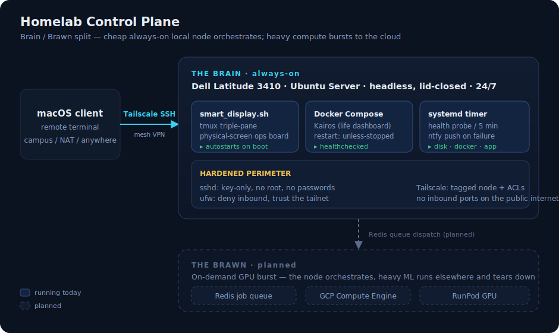
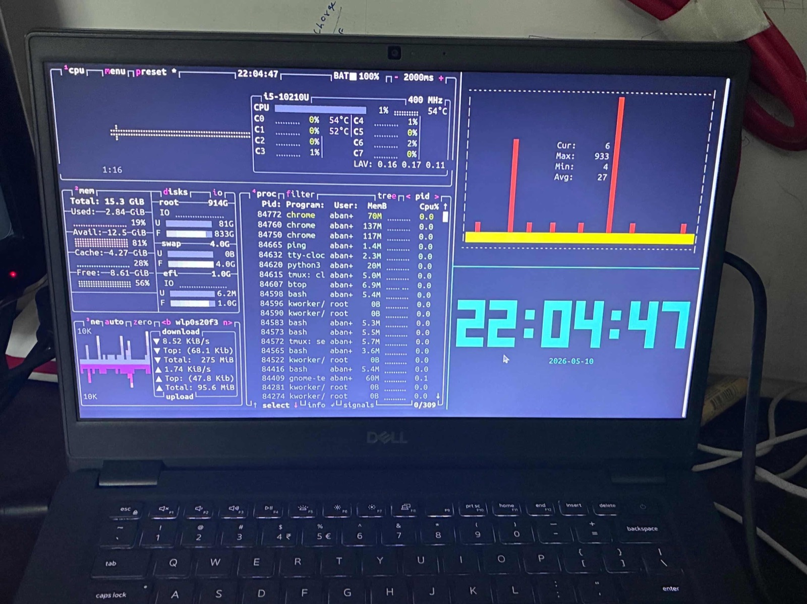

# ⚡ Homelab Control Plane

A recycled **Dell Latitude 3410** turned into a 24/7 headless Ubuntu server — the always-on **"Brain"** of a home lab: reachable from anywhere over Tailscale SSH, running with the lid closed, with a physical-screen ops dashboard and application workloads in Docker.

The design goal is a **Brain / Brawn split**: cheap local hardware stays on 24/7 to handle orchestration, state, and long-running processes, while heavy ML compute bursts out to on-demand cloud GPUs. This repo is the *control plane* — the always-on node that makes that possible — plus the tooling that runs on it.



> **Reproducible, not just described.** One command (`sudo ./setup.sh`) takes a fresh Ubuntu box to the state pictured above: packages, lid-close override, SSH hardening, firewall, the auto-starting dashboard, and a health-check timer. Every claim below is a file in this repo, not a story about one.

## Contents

- [Status — built vs. planned](#status--built-vs-planned)
- [Quickstart](#quickstart)
- [Repo layout](#repo-layout)
- [The hardware](#the-hardware)
- [The ops dashboard](#the-ops-dashboard)
- [Remote access (Tailscale)](#remote-access-tailscale)
- [Security](#security)
- [Health & alerting](#health--alerting)
- [Application host (Kairos)](#application-host-kairos)
- [Deep dive](#deep-dive)

## Status — built vs. planned

Honest scope. Everything marked ✅ is running today, with the file that makes it real; 🧭 is the roadmap the node is built to grow into.

| Layer | What | Where | State |
|---|---|---|---|
| Compute node | Headless Ubuntu on a Dell Latitude 3410, lid-closed, 24/7 | [`configs/logind.conf.d/`](configs/logind.conf.d) | ✅ Running |
| Remote access | Tailscale SSH from macOS — no port forwarding | [ENGINEERING §2](docs/ENGINEERING.md#2-remote-access-tailscale) | ✅ Running |
| Ops dashboard | `tmux` triple-pane physical-screen telemetry | [`smart_display.sh`](smart_display.sh) | ✅ Running |
| Boots itself | Dashboard auto-starts on reboot (tty1 autologin) | [`configs/getty@tty1.service.d/`](configs/getty@tty1.service.d) | ✅ Running |
| Application host | **Kairos** (personal life dashboard) via Docker Compose | [`docker-compose.yml`](docker-compose.yml) | ✅ Running |
| Hardened perimeter | Key-only SSH, `ufw` deny-in, Tailscale ACLs | [`configs/sshd_config.d/`](configs/sshd_config.d) | ✅ Running |
| Health & alerting | systemd timer → probe → ntfy push on failure | [`healthcheck.sh`](healthcheck.sh) | ✅ Running |
| One-command bootstrap | Fresh box → this node, idempotent | [`setup.sh`](setup.sh) | ✅ Running |
| Public ingress | Cloudflare Tunnel (`cloudflared`) for firewall-friendly HTTP | — | 🧭 Planned |
| Job queue | Redis-backed async worker model | — | 🧭 Planned |
| Cloud burst | Dispatch ML jobs to GCP Compute / RunPod GPUs | — | 🧭 Planned |

## Quickstart

On a fresh Ubuntu Server box (as the user who'll own the dashboard):

```bash
git clone https://github.com/banitsriram/homelab-control-plane.git
cd homelab-control-plane
sudo ./setup.sh            # idempotent — safe to re-run; prompts before changes
```

`setup.sh` is modular — run just the parts you want:

```bash
sudo ./setup.sh packages dashboard   # only those steps
sudo ./setup.sh --yes                # everything, non-interactive
```

Everything is also reachable through `make`:

```bash
make            # list targets
make dashboard  # launch the ops board now
make health     # run the health check once
make up         # start the Kairos app layer
```

## Repo layout

```
setup.sh              one-command, idempotent bootstrap (packages → hardening → autostart → health)
smart_display.sh      the tmux physical-screen ops dashboard
healthcheck.sh        node + app probe, pushes ntfy alerts on failure
docker-compose.yml    the Kairos application layer (env-at-creation, healthcheck, bounded logs)
Makefile              one entrypoint for the common tasks
configs/              system drop-ins setup.sh installs (logind, getty autologin, sshd, ufw, health timer, Tailscale ACL)
docs/ENGINEERING.md   full build log — headless config, Tailscale, the dashboard, and five real bugs
docs/architecture.svg the diagram above
```

## The hardware

An old **Dell Latitude 3410** running a minimal Ubuntu Server install, mounted lid-closed as an always-on node. Repurposing e-waste into a real 24/7 server — no cloud bill, full control of the box.

Running headless with the lid shut means overriding the default suspend-on-lid behavior. That override ships as a drop-in ([`configs/logind.conf.d/10-homelab-lid.conf`](configs/logind.conf.d/10-homelab-lid.conf)) that `setup.sh` installs; details in [ENGINEERING §1](docs/ENGINEERING.md#1-headless-hardware-configuration).

## The ops dashboard



*The real thing: `smart_display.sh` running headless on the Latitude's own screen.*

`smart_display.sh` turns the laptop's own screen into a live telemetry board using `tmux`:

- **Left** — `btop`: CPU / RAM / disk / network vitals
- **Top-right** — `gping`: link pulse to a target host
- **Bottom-right** — `tty-clock`

```bash
TARGET_IP=<your-host> ./smart_display.sh
```

The panes run inside self-healing loops with `SIGINT` traps, so a dropped host or a stray `Ctrl-C` can't leave a dead shell on the screen. And it **survives a reboot**: `setup.sh` installs a tty1 autologin drop-in plus a `.bash_profile` hook, so the board comes back on its own after a power blip — no keyboard needed. The full build story, including five real bugs and their fixes, is in [`docs/ENGINEERING.md`](docs/ENGINEERING.md).

## Remote access (Tailscale)

The node joins a private Tailscale mesh, so the macOS client can SSH in over any network — including restrictive campus/NAT setups — with no inbound ports opened. Setup and the headless-authentication tradeoff are in [ENGINEERING §2](docs/ENGINEERING.md#2-remote-access-tailscale); a ready-to-paste ACL for the preferred tagged-node approach is in [`configs/tailscale-acl.hujson`](configs/tailscale-acl.hujson).

## Security

A box you can reach from anywhere needs a real perimeter, so `setup.sh` applies one:

- **SSH** — key-only, no root, no passwords ([`configs/sshd_config.d/10-homelab-hardening.conf`](configs/sshd_config.d/10-homelab-hardening.conf)). The bootstrap refuses to apply this until it confirms you have key auth or Tailscale SSH, so it can't lock you out.
- **Firewall** — `ufw` defaults to deny-inbound and trusts only the tailnet, with a LAN-SSH fallback.
- **Tailnet** — the [ACL example](configs/tailscale-acl.hujson) moves the node from a non-expiring personal key to a tagged node with scoped access.

## Health & alerting

An ops node should tell *you* when it's unhealthy, not wait to be noticed. [`healthcheck.sh`](healthcheck.sh) runs from a systemd timer every 5 minutes and checks disk, the Docker daemon, the Kairos endpoint, and the Tailscale link. On failure it pushes to [ntfy](https://ntfy.sh) and logs to syslog. Point it at your topic in `/etc/homelab/health.env`:

```bash
# /etc/homelab/health.env
NTFY_URL=https://ntfy.sh/your-secret-topic
```

## Application host (Kairos)

The node hosts **[Kairos](https://github.com/banitsriram/Kairos)** (a personal life dashboard) via Docker Compose. [`docker-compose.yml`](docker-compose.yml) captures the pattern the node actually uses: env injected at container *creation* (see [ENGINEERING §5](docs/ENGINEERING.md#5-application-host--kairos)), `restart: unless-stopped`, a healthcheck, and bounded logs.

```bash
cp .env.example .env    # fill in
docker compose up -d
```

## Deep dive

[`docs/ENGINEERING.md`](docs/ENGINEERING.md) — full build log: headless configuration, the Tailscale ingress layer, the dashboard, the security perimeter, and the debugging log behind it.

## License

[MIT](LICENSE)
